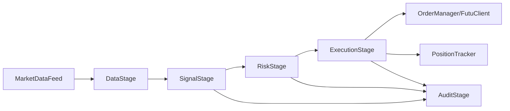

# futu-quant-trader

Production-oriented C++20 algorithmic trading system scaffold for Futu OpenAPI (OpenD), with modular architecture for data ingestion, signal modeling, risk checks, execution, and evaluation.

## Architecture



## Prerequisites
- CMake 3.25+
- Ninja
- vcpkg
- Futu OpenD gateway (paper or live account)

## Quick start (Docker Compose)
```bash
docker compose up --build
```

## Configuration
Environment-specific YAML configs live in `config/`:
- `config.dev.yaml`
- `config.staging.yaml`
- `config.prod.yaml`

## Backtesting
```bash
./scripts/run_backtest.sh
```

## Model training
```bash
cmake --preset dev -DCMAKE_EXPORT_COMPILE_COMMANDS=ON
cmake --build --preset dev -DCMAKE_EXPORT_COMPILE_COMMANDS=ON
./build/dev/futu_model_train --config config/config.dev.yaml
```

## Production deployment
Use `.github/workflows/deploy-prod.yml` (manual dispatch + environment approval).

## Risk disclaimer
Trading involves substantial risk. This software is provided for research and engineering purposes only.
