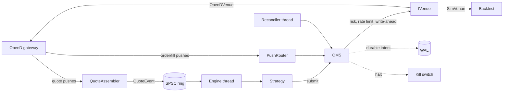

# Architecture

Automated trading of HK equities through Futu OpenD. One order path, shared by live trading, paper
trading and backtests; everything else is plumbing around it. Rules that must not be broken are in
`CLAUDE.md`; how to operate it is in `docs/runbook.md`; latency numbers are in `docs/latency.md`.

## Data and control flow

## Layers (each depends only on the ones above it)

| Layer | Where | Role |
|---|---|---|
| core | `core/` | `Result`, `Clock`, `SpscRing`, money as int64 mills, shared enums |
| wire | `opend/` | 44-byte framing, connection, protobuf client, quote and trade decoding. Command IDs are pinned in `proto_ids.hpp` |
| domain | `oms/`, `risk/`, `execution/`, `portfolio/`, `instrument/` | order state machine, pre-trade chain, kill switch, rate limiter, position book, HK rules, live gate |
| strategy | `strategy/` | `IStrategy` + `StrategyContext` (no wall clock, no venue, no future data), reference strategies, `makeStrategy` factory |
| runtime | `engine/`, `infra/` | engine thread and ring, WAL, metrics, secrets, histograms |
| backtest | `backtest/`, `data/` | `SimVenue`, runner, metrics, golden gate; drives the **same** `Oms` |
| app | `app/`, `main.cpp` | config, composition root, startup stages, shutdown, ops endpoints |

## Patterns worth knowing

* **Facade + private implementation.** `oms::Oms` is the public face; its state and lock-held helpers
  live in `src/oms/oms_impl.hpp` and are split by concern: `oms.cpp` (lifecycle, events, queries),
  `oms_submit.cpp` (the submit pipeline: validate, dedupe, screen, admit, write-ahead, place, record),
  `oms_reconcile.cpp` (orders, positions, cash, verdict).
* **Ports and adapters.** `IVenue` is the only door to a broker: `OpenDVenue` (real/paper) and
  `SimVenue` (backtest) are interchangeable, which is what makes a backtest evidence about live.
* **Typestate for money.** A REAL `TradeTarget` cannot be built without a `LiveApproval`, which only
  `LiveGate` issues; the only exception is a read-only header the wire layer refuses to write with.
* **Composition root.** `app::TradingStack` builds and owns the whole object graph in dependency order and
  closes the OpenD link before tearing it down; `app::Trader` runs the startup/trade/shutdown *stages*
  (each returns an exit code or continues); `app::LinkGuard` is the RAII re-lock + close.
* **One mapping point.** `app/config_mapping` is the only place the validated `AppConfig` becomes each
  component's own config, so the REAL startup check and the live stack cannot disagree on limits.
* **Factory.** `strategy::makeStrategy(StrategySpec)` builds strategies for the live process and the
  backtest CLI alike.
* **Write-ahead log + restore.** Order intents are durable before they are sent and restored after a crash
  as "unknown outcome" (never resent); see rules 10, 16 and 18.
* **Pull-model metrics.** A metric is a function that reads a counter the component already keeps.

## Legacy

`model/`, `data/data_normalizer` and `futu_model_train` are the offline model-training path (separate
from trading). The old in-memory `FutuClient`, `TradingPipeline`, `OrderManager` and `Backtester`
scaffolding was removed: it used wrong command IDs and bypassed the OMS.
